

**Remote Desktop Feature Matrix** is an open, independent, and community-driven comparison matrix for remote desktop software and hardware KVM-over-IP solutions.

Our goal is to gather the most detailed information about functionality, latency, supported codecs, and hardware capabilities in one place, so everyone can choose the perfect tool for their needs.

### 👉 [Click here to view the Interactive Web Matrix](https://USBridge-Technologies.github.io/Remote-Access-Feature-Matrix/)

> [!WARNING]
> **Disclaimer:** The data in this matrix is community-driven and may contain inaccuracies. For guaranteed accuracy, please refer directly to the official documentation or contact the respective software/hardware providers.

---

**Brought to you by the USBridge Team**
We develop the ultimate zero-latency remote desktop solution and a top-tier hardware complex for BIOS-level control.

 

---

## 🖥️ Supported Software Providers

|  |  |  |  |  |
| :---: | :---: | :---: | :---: | :---: |
|  [**USBridge**](https://usbridge.io) |  [**RustDesk**](https://rustdesk.com) |  [**AnyDesk**](https://anydesk.com) |  [**Parsec**](https://parsec.app) |  [**TeamViewer**](https://teamviewer.com) |
|  [**SPICE**](https://www.spice-space.org) | 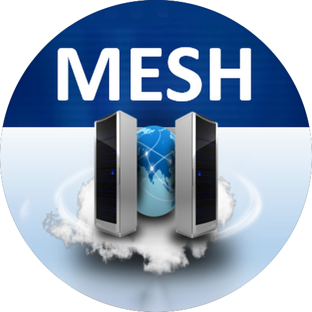 [**MeshCentral**](https://meshcentral.com) | 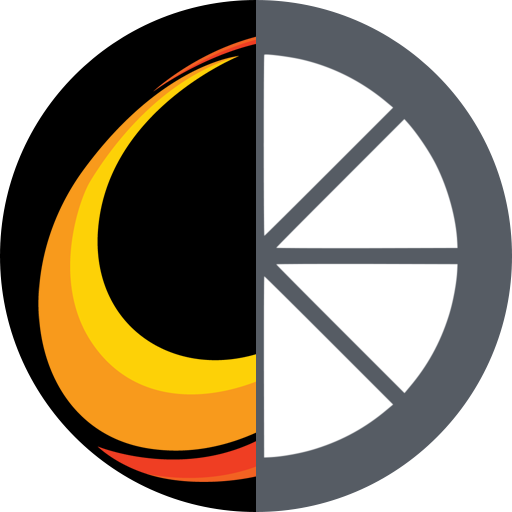 [**Moonlight / Sunshine**](https://moonlight-stream.org/) |  [**Chrome R. D.**](https://remotedesktop.google.com) |  [**Microsoft RDP**](https://learn.microsoft.com/windows-server/remote/remote-desktop-services/welcome-to-rds) |
|  [**TightVNC**](https://www.tightvnc.com) | 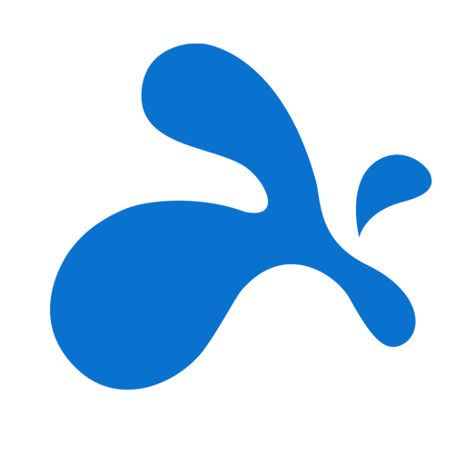 [**Splashtop**](https://www.splashtop.com) | 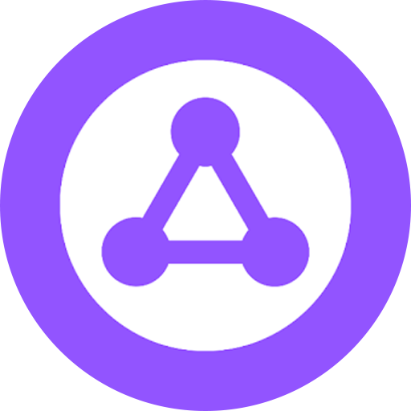 [**LogMeIn**](https://www.logmein.com/products/resolve) |  [**Apache Guacamole**](https://guacamole.apache.org) | 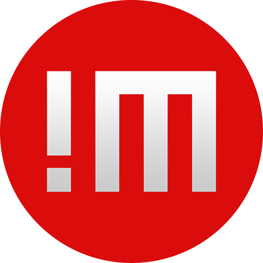 [**NoMachine (NX)**](https://www.nomachine.com) |
|  [**X2Go**](https://wiki.x2go.org) | 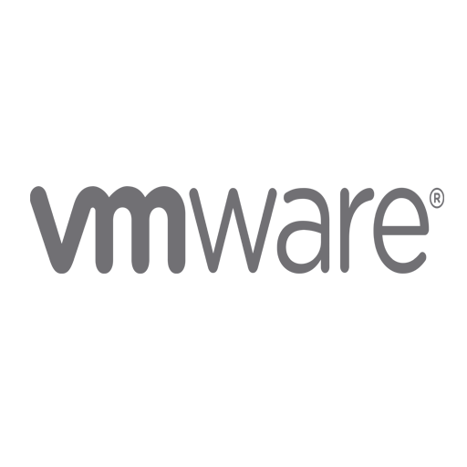 [**VMware Blast Extreme**](https://www.omnissa.com/products/horizon) | 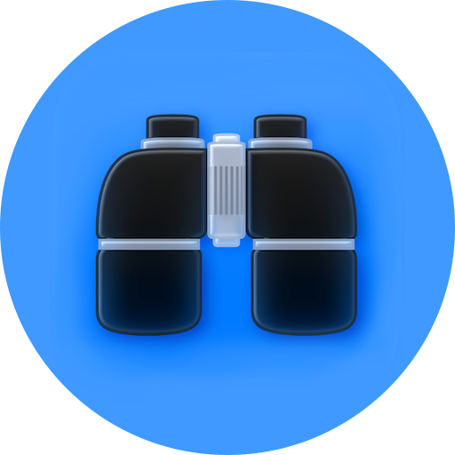 [**Apple Remote Desktop**](https://apps.apple.com/app/apple-remote-desktop/id409907375) | 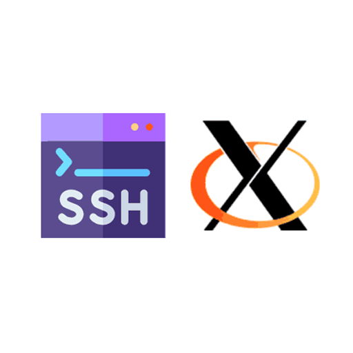 [**SSH + X11**](https://www.openssh.com) | 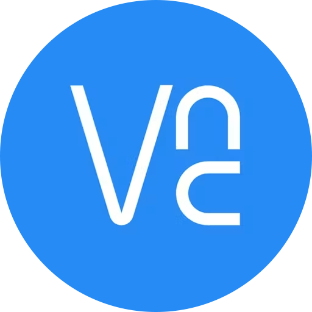 [**RealVNC Connect**](https://www.realvnc.com) |
|  [**GoToMyPC**](https://get.gotomypc.com) | 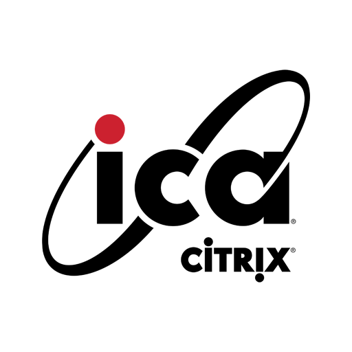 [**Citrix HDX / ICA**](https://www.citrix.com/products/citrix-virtual-apps-and-desktops) | 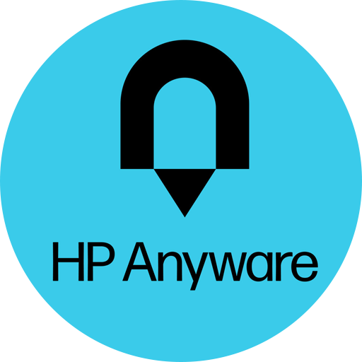 [**HP Teradici PCoIP**](https://www.hp.com/us-en/workstations/hp-anyware.html) | 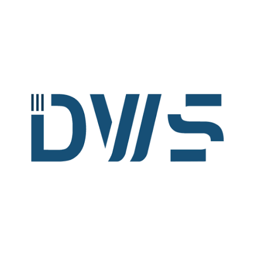 [**DWService**](https://www.dwservice.net) | 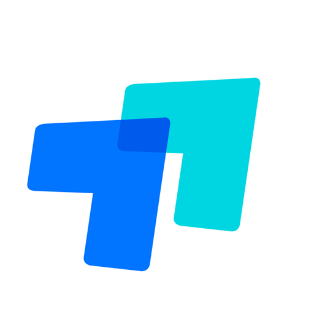 [**ToDesk**](https://www.todesk.com) |
| 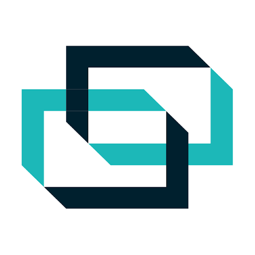 [**ConnectWise ScreenConnect**](https://screenconnect.connectwise.com) | | | | |

## 🔌 Supported KVM Providers

|  |  |  |  |  |
| :---: | :---: | :---: | :---: | :---: |
|  [**USBridge KVM 2.0**](https://usbridge.io) |  [**JetKVM**](https://jetkvm.com) |  [**PiKVM V4 Plus**](https://pikvm.org/) | | |

---

## 🤝 How to Contribute (Add your software or propose an edit)

We've made the contribution process as simple as possible for everyone! You don't need to understand code or clone the repository to contribute.

1. Go to our interactive web matrix: **[https://USBridge-Technologies.github.io/Remote-Access-Feature-Matrix/](https://USBridge-Technologies.github.io/Remote-Access-Feature-Matrix/)**
2. To **edit** a parameter: simply double-click on any cell in the table.
3. To **add** a new provider: click the `+ Add New Provider` button in the top right corner.
4. Click **"Send Pull Request"** in the popup bar at the bottom of the screen.

The system will automatically generate a JSON file and send a Pull Request on your behalf. We welcome all contributions to help keep this matrix accurate and up to date!

---

## 📊 Methodology

**Where the data comes from:** Every parameter is initially populated using public sources — official documentation, vendor websites, changelogs, and technical reviews — not internal testing on our end. This is a starting point, not a final verdict.

**What Yes / Partial / No mean:**
- **Yes** — the feature is documented and available without extra workarounds.
- **Partial** — the feature exists but is limited (e.g. paid-tier only, requires a specific OS version, or has known bugs/caveats — see the ⓘ tooltip on each cell for specifics).
- **No** — not supported, or no public evidence it's supported.
- **Unknown** — we couldn't find a reliable public source either way. We'd rather show "Unknown" than guess.

**This is why it's open-source.** Software changes fast — a "Partial" today might be "Yes" next release, and pricing pages update constantly. Rather than claiming to be a permanently accurate authority, we're built so **anyone can fix what's wrong right now**, without touching code (see "How to Contribute" above). Every entry, right or wrong, is meant to get better over time through the community — not through us alone.
